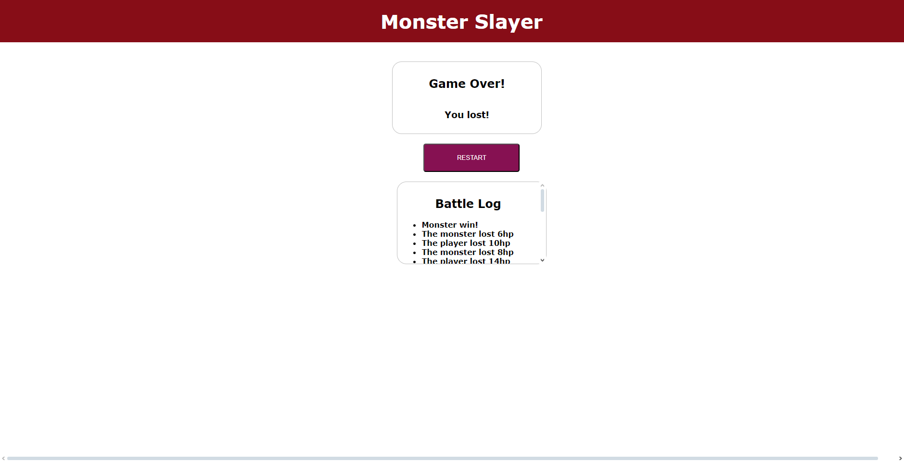

# Мини-игра "Monster Slayer"

### Привет, я Денис, и я написал свою мини-игру на Вью (это моя вторая работа на данном фремворке)

### Ты можешь посмотреть [краткий видео-обзор](https://youtu.be/FOSFAGirKeI), а можешь почитать этот пост

### Главы

- [Начало](#начало)
- [Игра](#Игра)

## Игра ([в начало](#начало))

### При запуске сайта мы видим название игры в шапке + саму игру под шапкой. Сайт показывает хп монстра и хп юзера, ввиде хотбара + числовой показатель. Ниже доступны кнопки для атаки, супер-атаки (что бы она стала доступной - нужно совершить минимум 3 обычные атаки), реген хп и капитуляция. Во время атаки / супер атаки / лечения - монстр атакует игрока в ответ, от чего тупо зафлудить кнопкой атаки нельзя. Для победы в игре - необходимо оставить монстру 0 хп. По окончанию игры (победе, проигрышу или ничье) - игрок увидит окно "Гейм овер". Внизу сайта находится батл-лог, с инфой о событиях игры

